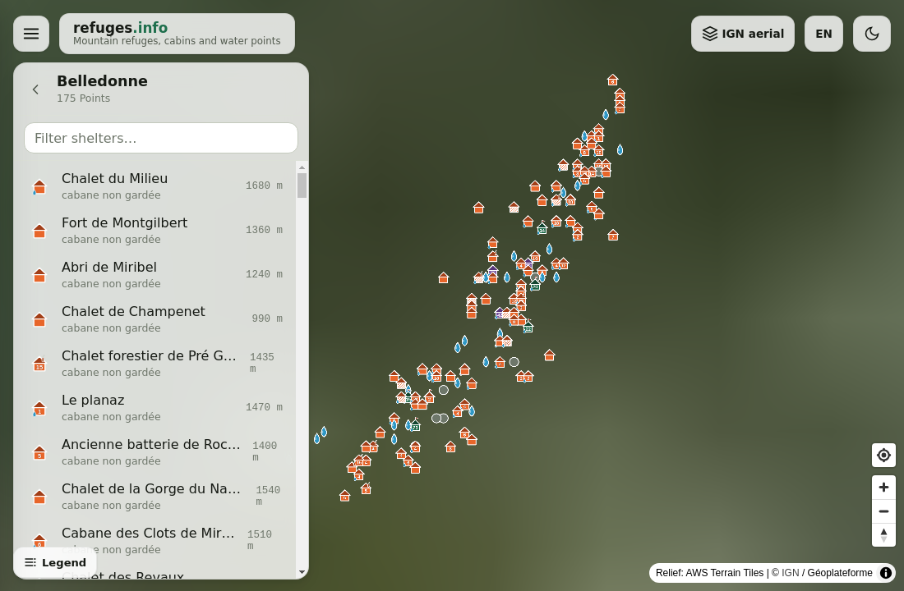

# refuges.info — nouveau front-end

Réécriture de l'interface web de [refuges.info](https://www.refuges.info), la base
collaborative des refuges, cabanes non gardées, gîtes et points d'eau de montagne.

**🌐 Démo : [refuges-info.vercel.app](https://refuges-info.vercel.app)**



**Périmètre : le front-end uniquement.** Le back-end (base PostgreSQL, contributions,
photos, forum) n'est pas réimplémenté : cette application consomme l'[API publique
existante](https://www.refuges.info/api/doc/) en lecture seule. Voir [ANALYSIS.md](./ANALYSIS.md)
pour l'analyse complète du site actuel et de son API.

## Stack

- [Vite](https://vite.dev/) — build / dev server
- [Lit](https://lit.dev/) + TypeScript — composants web (Web Components)
- [@lit/localize](https://lit.dev/docs/localization/overview/) — i18n (défaut **EN**, **EN + FR** en v1)
- [MapLibre GL JS](https://maplibre.org/) — globe 3D + carte vectorielle WebGL
- Fonds de carte (liste déroulante) : [OpenFreeMap](https://openfreemap.org/)
  (vectoriel, sans clé), [OpenTopoMap](https://opentopomap.org/) (raster topo) et
  **IGN orthophotos** (photo aérienne, WMTS Géoplateforme sans clé)
- Relief 3D : tuiles DEM *terrarium* hébergées sur **Amazon S3** (AWS Terrain Tiles)
- API refuges.info — source de données (GeoJSON, CC By-Sa 2.0)

Identité visuelle : voir [CHARTE_GRAPHIQUE.md](./CHARTE_GRAPHIQUE.md) (thèmes clair/sombre,
palette outdoor, tokens). Les tokens sont injectés dans [src/index.css](./src/index.css).

## Démarrage

```bash
npm install
npm run dev      # serveur de dev sur http://localhost:5173
```

Le serveur de dev proxifie `/api/*` **et** `/point_recherche` vers
`https://www.refuges.info` (voir [vite.config.ts](./vite.config.ts)) pour éviter les
problèmes de CORS.

### Scripts

| Commande                  | Description                                          |
| ------------------------- | ---------------------------------------------------- |
| `npm run dev`             | Serveur de développement avec HMR                    |
| `npm run build`           | Type-check (`tsc`) puis build de production          |
| `npm run preview`         | Sert le build de production localement               |
| `npm run typecheck`       | Vérifie les types sans émettre                       |
| `npm run localize:extract`| Extrait les chaînes `msg()` vers `xliff/fr.xlf`      |
| `npm run localize:build`  | Génère les templates traduits (`src/generated/`)     |

### Internationalisation

Toutes les chaînes passent par `msg()` (centralisées dans [src/labels.ts](./src/labels.ts),
avec un id stable). Pour ajouter/modifier une traduction : éditer le texte source,
lancer `npm run localize:extract`, traduire dans [xliff/fr.xlf](./xliff/fr.xlf), puis
`npm run localize:build`. La langue par défaut est l'anglais ; le choix est mémorisé
(localStorage) et devine la langue du navigateur au premier chargement.

### Configuration

En production, l'API n'est pas proxifiée. Définissez l'origine de l'API via une
variable d'environnement Vite :

```bash
# .env.production
VITE_API_BASE=https://www.refuges.info
```

## Structure

```
src/
├── main.ts                      # point d'entrée — init i18n + <home-page>
├── index.css                    # tokens de design (clair/sombre) + reset
├── i18n.ts                      # configuration @lit/localize (runtime)
├── labels.ts                    # toutes les chaînes traduisibles (msg())
├── router.ts                    # routeur minimal (/ et /massif/:slug)
├── slug.ts                      # slug d'un massif ↔ nom
├── icons.ts                     # composition des icônes SVG par type + indications
├── generated/                   # locale-codes + templates FR (générés)
├── data/menu.ts                 # liens du menu burger (URLs réelles du site)
├── api/
│   ├── config.ts                # base d'API (dev proxy / VITE_API_BASE)
│   ├── client.ts                # client points : /api/bbox, /api/massif, /api/point
│   ├── massifs.ts               # liste des 494 massifs (/api/polygones?type_polygon=1)
│   ├── search.ts                # recherche serveur via /point_recherche (parse HTML)
│   └── types.ts                 # types GeoJSON + ids de catégories
└── components/
    ├── app-shell.ts             # coquille persistante : globe + barre + panneau
    ├── app-globe.ts             # globe MapLibre (instance unique, jamais remontée)
    ├── nav-menu.ts              # bouton burger + tiroir de navigation
    ├── discovery-panel.ts       # recherche serveur + liste des massifs
    ├── massif-panel.ts          # page /massif/:slug — points du massif
    ├── point-detail-panel.ts    # fiche d'un point (infos + photos + « Voir plus »)
    └── map-legend.ts            # légende repliable des icônes
```

## Icônes & fiche d'un point

- **Icônes composées** ([icons.ts](./src/icons.ts)) : une forme colorée par type
  (refuge, cabane, gîte, point d'eau, sommet, abri) sur laquelle se superposent des
  indications — cheminée, nombre de couchages, hachures si l'abri n'a que 3 murs,
  goutte d'eau à proximité — dans l'esprit des pictogrammes du site original.
  Affichées sur la carte (couche `symbol`) et dans les listes.
- **Légende** repliable (`<map-legend>`, en bas à gauche) expliquant types et symboles.
- **Clic sur un point** → panneau à droite (`<point-detail-panel>`) : infos
  principales, **photos** (miniatures issues des contributions) et bouton
  **« Voir plus »** vers la fiche complète sur refuges.info (détails, commentaires).
- **Terrain 3D** activé (`setTerrain`, relief Amazon). L'inertie de déplacement est
  désactivée (`dragPan: { maxSpeed: 0 }`) pour éviter le « glissement » de caméra au
  relâchement du clic sur le terrain.
- **Changement de fond de carte sans perte** : à chaque `setStyle`, MapLibre vide
  sources, couches et images ; un indicateur `styleReady` garantit que les points
  (et leurs icônes) sont ré-injectés au `style.load` suivant.

## Navigation & carte persistante

L'application est une **coquille unique** (`<app-shell>`) : le globe est créé **une
seule fois** et n'est jamais rechargé ; seul le panneau latéral change selon la route.

- `/` — **Accueil** : `<discovery-panel>` (recherche serveur via `/point_recherche`
  sur toute la base + liste des 494 massifs).
- `/massif/:slug` — **Massif** : `<massif-panel>` liste les points du massif
  (`/api/massif`). La même carte cadre le massif et affiche ses points ; cliquer un
  point y fait voler le globe.

## Page d'accueil

- **Globe 3D** plein écran (projection *globe*) avec relief (DEM terrarium AWS sur
  Amazon S3) au-dessus d'un fond **OpenFreeMap** (vectoriel) ou **OpenTopoMap** (raster).
- **Menu burger** (`<nav-menu>`) reprenant les entrées du site historique.
- **Bascules** dans la barre supérieure : fond de carte, langue (EN/FR), thème
  (clair/sombre). Les marqueurs et puces sont **monochromes** (couleur de marque).

## Licence des données

Les données proviennent de refuges.info sous licence **CC By-Sa 2.0** (résultats
OpenStreetMap sous **ODbL**). Voir la [page licence](https://www.refuges.info/wiki/licence).
